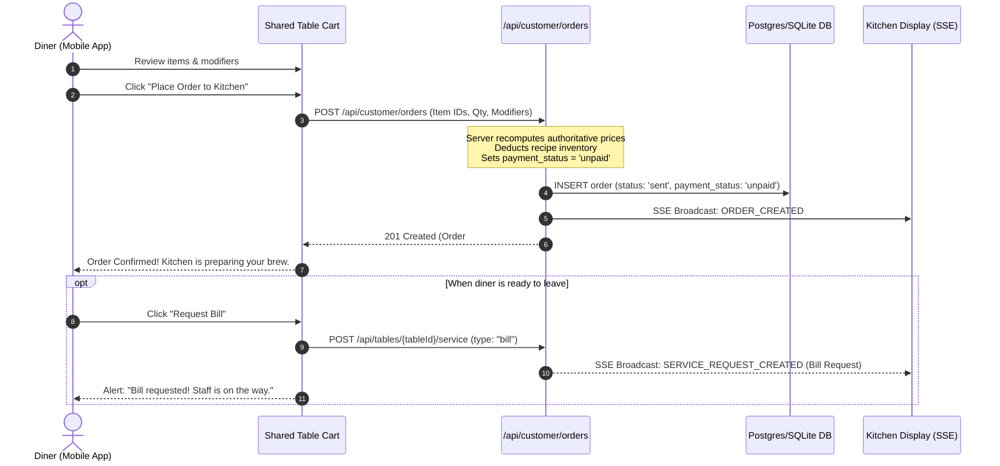
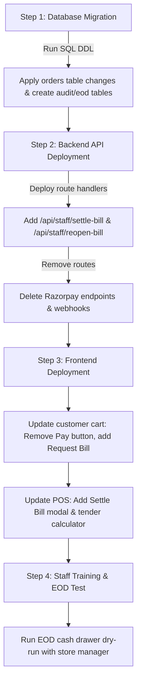

# Technical Specification: Offline Counter Settlement & POS Audit Architecture
**Document Version:** 2.0.0-PROD  
**Status:** Approved for Implementation  
**Target System:** Aura Cafe Ordering Platform & Point of Sale (POS)  
**Author:** Principal Full-Stack Software Engineer & Solutions Architect  

---

## Executive Summary & Design Rationale

### The Business Context
The cafe ordering workflow is transitioning from **online pre-payment (Razorpay / client-side payment gateways / webhook listeners)** to an **offline counter settlement model**. 

Under this model:
1. **Diners** scan a cryptographic QR token at their table, authenticate with Phone/OTP, browse the menu, and place orders directly to the Kitchen Display System (KDS).
2. **Payment is handled offline** at the service counter or tableside via traditional cafe channels (**Cash, UPI, or Card/EDC terminal**).
3. **Staff members (Cashier / Manager / Admin)** inspect the final table bill in the POS dashboard, apply any authorized discounts or tips, collect payment, select the tender method, and mark the order **"Settled / Paid"**.
4. **The system automatically generates a legally compliant Indian GST Tax Invoice (SAC 996331)**, closes the table session, dispatches an invoice link/PDF to the customer's verified WhatsApp, and logs an immutable audit event.

### Why Remove Online Payment Processing?
| Dimension | Online Pre-Payment Model | Offline Counter Settlement Model |
| :--- | :--- | :--- |
| **Transaction Fees** | 2.0% – 2.5% + GST Gateway MDR per ticket. | **0% MDR on UPI and Cash**; standard offline EDC interchange on cards only. |
| **Ordering Friction** | Diners must pay before food prep begins; repeated carts require repeated OTPs/UPI apps. | **Frictionless continuous ordering**; diners open a tab and settle once before leaving. |
| **Gateway Drop-offs** | Bank OTP failures, payment timeouts, and webhook retries cause kitchen order limbo. | **Instant counter verification**; 100% immune to internet payment gateway outages. |
| **Operational Reality** | Diners frequently add extra items (water, dessert, coffee) during a meal. | Orders accumulate cleanly on the shared table session; single final settlement. |

### The Core Architectural Shift
Removing payment webhooks shifts the **trust boundary** from external payment gateways to **staff actions**. Because staff physically collect money and manually mark bills as paid, the system must treat settlement as a **privileged, strictly audited, and financially accountable event** to prevent cashier fraud, cash skimming, unauthorized voids, and unaccounted discounts.

---

## 1. Data Model Changes

### 1.1 Summary of Schema Modifications
- **`orders` table**:
  - Deprecate multi-status payment strings (`cash_pending`, `refunded`, `failed`).
  - Constrain `payment_status` to strictly `unpaid | paid`.
  - Add `payment_method` (`cash | upi | card`).
  - Add accountability fields: `settled_by` (staff ID), `settled_at` (timestamp).
  - Add discount and tip accounting fields: `discount_amount`, `discount_type`, `discount_reason`, `discount_authorized_by`, `tip_amount`.
  - Add cancellation/void tracking: `is_void`, `void_reason`, `voided_by`, `voided_at`.
- **`settlement_audit_logs` table (New)**:
  - Append-only ledger recording all settlements, discounts, voids, and bill reopenings.
- **`eod_reconciliations` table (New)**:
  - End-of-Day cash drawer audit records tracking expected vs. actual cash counts and cash variances.
- **`invoice_sequences` table (New)**:
  - Concurrency-safe atomic daily sequence counter for GST invoices.

---

### 1.2 Entity Specifications

#### A. `orders` Table Changes
```sql
-- Alter orders table to enforce offline settlement semantics
ALTER TABLE orders 
  DROP COLUMN IF EXISTS razorpay_order_id,
  DROP COLUMN IF EXISTS razorpay_payment_id;

-- 1. Payment status & method constraints
ALTER TABLE orders
  ADD COLUMN payment_status VARCHAR(16) NOT NULL DEFAULT 'unpaid' 
    CHECK (payment_status IN ('unpaid', 'paid')),
  ADD COLUMN payment_method VARCHAR(16) NULL 
    CHECK (payment_method IN ('cash', 'upi', 'card')),
  ADD COLUMN settled_by VARCHAR(64) NULL REFERENCES staff_accounts(id),
  ADD COLUMN settled_at TIMESTAMP WITH TIME ZONE NULL;

-- 2. Discount & Tip structures
ALTER TABLE orders
  ADD COLUMN discount_amount DECIMAL(10, 2) NOT NULL DEFAULT 0.00,
  ADD COLUMN discount_type VARCHAR(16) NULL 
    CHECK (discount_type IN ('flat', 'percentage', 'comp', 'staff_meal')),
  ADD COLUMN discount_reason TEXT NULL,
  ADD COLUMN discount_authorized_by VARCHAR(64) NULL REFERENCES staff_accounts(id),
  ADD COLUMN tip_amount DECIMAL(10, 2) NOT NULL DEFAULT 0.00;

-- 3. Void / Cancellation audit fields
ALTER TABLE orders
  ADD COLUMN is_void BOOLEAN NOT NULL DEFAULT FALSE,
  ADD COLUMN void_reason TEXT NULL,
  ADD COLUMN voided_by VARCHAR(64) NULL REFERENCES staff_accounts(id),
  ADD COLUMN voided_at TIMESTAMP WITH TIME ZONE NULL;
```

#### Field Specifications:
| Field Name | Type | Nullable | Default | Description |
| :--- | :--- | :---: | :--- | :--- |
| `payment_status` | `VARCHAR(16)` | No | `'unpaid'` | Status of the bill. Must be either `'unpaid'` or `'paid'`. |
| `payment_method` | `VARCHAR(16)` | Yes | `NULL` | Tender type selected by cashier upon settlement: `'cash'`, `'upi'`, or `'card'`. `NULL` when unpaid. |
| `settled_by` | `VARCHAR(64)` | Yes | `NULL` | ID of the authenticated staff member who collected funds and completed the transaction. |
| `settled_at` | `TIMESTAMPTZ` | Yes | `NULL` | Server timestamp when the bill was marked paid. |
| `discount_amount`| `DECIMAL(10,2)`| No | `0.00` | Total value subtracted from gross subtotal. |
| `discount_type` | `VARCHAR(16)` | Yes | `NULL` | Category of reduction: `'flat'`, `'percentage'`, `'comp'`, `'staff_meal'`. |
| `discount_reason`| `TEXT` | Yes | `NULL` | Mandatory audit explanation if `discount_amount > 0`. |
| `discount_authorized_by`| `VARCHAR(64)` | Yes | `NULL` | Staff ID of Manager/Admin if cashier discount exceeded permission threshold. |
| `tip_amount` | `DECIMAL(10,2)`| No | `0.00` | Optional gratuity added by customer during counter settlement. |
| `subtotal` | `DECIMAL(10,2)`| No | - | Authoritative gross item sum prior to discounts. |
| `cgst_amount` | `DECIMAL(10,2)`| No | `0.00` | 2.5% tax on net taxable amount `(subtotal - discount_amount)`. |
| `sgst_amount` | `DECIMAL(10,2)`| No | `0.00` | 2.5% tax on net taxable amount `(subtotal - discount_amount)`. |
| `total_amount` | `DECIMAL(10,2)`| No | - | Authoritative net payable: `(subtotal - discount) + taxes + service_charge + tip`. |
| `is_void` | `BOOLEAN` | No | `FALSE` | Set to `TRUE` if order was canceled before or during preparation. |

---

#### B. `settlement_audit_logs` Table (New)
An append-only security log guaranteeing non-repudiation. Once written, records can never be updated or deleted.

```sql
CREATE TABLE settlement_audit_logs (
  id VARCHAR(64) PRIMARY KEY,
  order_id VARCHAR(64) NOT NULL REFERENCES orders(id),
  action VARCHAR(32) NOT NULL 
    CHECK (action IN ('SETTLED', 'REOPENED', 'DISCOUNT_APPLIED', 'VOIDED', 'TIP_MODIFIED')),
  actor_id VARCHAR(64) NOT NULL,
  actor_name VARCHAR(128) NOT NULL,
  actor_role VARCHAR(32) NOT NULL,
  payment_method VARCHAR(16) NULL,
  gross_subtotal DECIMAL(10, 2) NOT NULL,
  discount_amount DECIMAL(10, 2) NOT NULL DEFAULT 0.00,
  tax_amount DECIMAL(10, 2) NOT NULL DEFAULT 0.00,
  final_amount DECIMAL(10, 2) NOT NULL,
  reason TEXT NULL,
  metadata JSONB NOT NULL DEFAULT '{}'::jsonb,
  ip_address VARCHAR(45) NOT NULL,
  user_agent TEXT NULL,
  created_at TIMESTAMP WITH TIME ZONE NOT NULL DEFAULT NOW()
);

CREATE INDEX idx_audit_order ON settlement_audit_logs(order_id);
CREATE INDEX idx_audit_actor ON settlement_audit_logs(actor_id);
CREATE INDEX idx_audit_created_at ON settlement_audit_logs(created_at);
```

---

#### C. `eod_reconciliations` Table (New)
Tracks physical cash counted in drawer against system-recorded cash sales at shift end.

```sql
CREATE TABLE eod_reconciliations (
  id VARCHAR(64) PRIMARY KEY,
  business_date DATE NOT NULL UNIQUE,
  opened_at TIMESTAMP WITH TIME ZONE NOT NULL,
  closed_at TIMESTAMP WITH TIME ZONE NOT NULL DEFAULT NOW(),
  closed_by VARCHAR(64) NOT NULL REFERENCES staff_accounts(id),
  opening_float DECIMAL(10, 2) NOT NULL,
  system_cash_sales DECIMAL(10, 2) NOT NULL,
  system_upi_sales DECIMAL(10, 2) NOT NULL,
  system_card_sales DECIMAL(10, 2) NOT NULL,
  gross_sales DECIMAL(10, 2) NOT NULL,
  total_discounts DECIMAL(10, 2) NOT NULL,
  total_voids_count INTEGER NOT NULL DEFAULT 0,
  expected_cash_in_drawer DECIMAL(10, 2) NOT NULL, -- opening_float + system_cash_sales
  actual_cash_counted DECIMAL(10, 2) NOT NULL,
  cash_variance DECIMAL(10, 2) NOT NULL,          -- actual_cash_counted - expected_cash_in_drawer
  variance_notes TEXT NULL,
  status VARCHAR(16) NOT NULL DEFAULT 'BALANCED' 
    CHECK (status IN ('BALANCED', 'OVERAGE', 'SHORTAGE', 'DISCREPANCY_FLAGGED'))
);
```

---

#### D. `invoice_sequences` Table (New)
Guarantees uninterrupted, strictly monotonic daily invoice numbering without sequence gaps or race conditions.

```sql
CREATE TABLE invoice_sequences (
  sequence_date DATE PRIMARY KEY,
  last_sequence INTEGER NOT NULL DEFAULT 0
);
```

---

## 2. API Changes

### 2.1 Endpoints Deleted / Deprecated
1. **`POST /api/payments/razorpay/create-order`**
   - **Status:** **DELETED** (Returns `410 Gone`).
   - Reason: Online payment order IDs are no longer created.
2. **`POST /api/webhooks/payment`**
   - **Status:** **DELETED** (Returns `410 Gone`).
   - Reason: No external gateway events exist. Eliminates webhook spoofing and replay attacks.

---

### 2.2 Customer Ordering Refactor (`shared-table-cart-modal.tsx`)
The customer cart interface no longer features Razorpay buttons or payment method toggles.



#### API Specification: `POST /api/customer/orders`
- **Authentication:** Valid cryptographic table token (`aura_table_token`) + Diner session cookie (`aura_diner_session`).
- **Client Payload:**
  ```json
  {
    "table_id": "tbl-01",
    "customer_name": "Aarav Sharma",
    "items": [
      {
        "menu_item_id": "item-spanish-latte",
        "quantity": 2,
        "selected_option_ids": ["opt-oat", "opt-shot-extra"],
        "notes": "Extra hot please"
      }
    ],
    "service_charge_opt_in": true
  }
  ```
- **Server Enforcement:**
  - Client-submitted prices or totals are strictly forbidden and rejected.
  - Line items are priced using database authority.
  - `orders.payment_status` is hardcoded to `'unpaid'`.
  - `orders.payment_method` is initialized to `NULL`.
  - Response returns `payment_status: "unpaid"`.

---

### 2.3 New Staff Endpoint: `POST /api/staff/settle-bill`
This is the primary financial transaction endpoint in the redesigned system.

#### Endpoint Signature
- **Method:** `POST`
- **Route:** `/api/staff/settle-bill`
- **Access Level:** Staff Only (`admin`, `manager`, `cashier`). Waitstaff and Kitchen are forbidden (`403 Forbidden`).
- **Rate Limit:** 60 requests per minute per authenticated staff ID.

#### Request Headers
```http
Content-Type: application/json
Authorization: Bearer <staff_jwt_token>
Cookie: aura_staff_session=<staff_jwt_token>
```

#### Request Payload
```json
{
  "orderId": "ord-88f2b314a92c",
  "paymentMethod": "cash",
  "discount": {
    "type": "percentage",
    "value": 10.0,
    "reason": "Regular guest loyalty discount",
    "managerPin": "1111"
  },
  "tip": 40.0,
  "serviceChargeOptIn": true,
  "customerPhone": "+919876543210"
}
```

#### Validation Logic
1. **RBAC Authorization**: Verify caller role is `admin`, `manager`, or `cashier`.
2. **Order Existence & State**:
   - Order must exist.
   - Order `payment_status` must currently be `'unpaid'`. If already `'paid'`, return `409 Conflict`.
   - Order `is_void` must be `false`.
3. **Payment Method Verification**:
   - Must be one of: `'cash'`, `'upi'`, `'card'`.
4. **Discount Authorization Policy**:
   - If `discount` is present:
     - `reason` is **mandatory** (minimum 5 characters).
     - **Cashier limit**: Up to 10% or ₹200 flat.
     - **Discounts > 10% or > ₹200**: Require `managerPin` or caller role `manager` / `admin`. If invalid, return `403 Forbidden: Manager PIN required for discounts exceeding 10%`.
     - Max allowed discount: 100% (Complimentary).
5. **Tip Validation**:
   - `tip >= 0` and `tip <= 2000.00`.

#### Execution Pseudocode
```typescript
export async function settleBillHandler(req: Request) {
  // 1. Authenticate Staff
  const staff = await verifyStaffSession(["admin", "manager", "cashier"], req);
  if (!staff.authorized) return json({ error: staff.error }, { status: 403 });

  const body: SettleBillRequest = await req.json();

  return await db.transaction(async (tx) => {
    // 2. Lock Order Record
    const order = await tx.query(
      "SELECT * FROM orders WHERE id = ? FOR UPDATE", 
      [body.orderId]
    );
    if (!order) return json({ error: "Order not found" }, { status: 404 });
    if (order.payment_status === "paid") {
      return json({ error: "Order is already settled" }, { status: 409 });
    }

    // 3. Compute Financial Breakdown
    const subtotal = order.subtotal;
    let discountAmount = 0;

    if (body.discount && body.discount.value > 0) {
      if (body.discount.type === "percentage") {
        discountAmount = Number(((subtotal * body.discount.value) / 100).toFixed(2));
      } else {
        discountAmount = Number(body.discount.value.toFixed(2));
      }
      discountAmount = Math.min(discountAmount, subtotal);
    }

    const netTaxable = Math.max(0, subtotal - discountAmount);
    const cafe = await tx.query("SELECT * FROM cafe LIMIT 1");
    const cgst = Number((netTaxable * cafe.cgst_rate).toFixed(2)); // 2.5%
    const sgst = Number((netTaxable * cafe.sgst_rate).toFixed(2)); // 2.5%
    const totalTax = cgst + sgst;
    const serviceFee = body.serviceChargeOptIn ? Number((netTaxable * cafe.service_fee_rate).toFixed(2)) : 0;
    const tip = Math.max(0, Number(body.tip || 0));
    const finalPayable = Number((netTaxable + totalTax + serviceFee + tip).toFixed(2));

    // 4. Generate Atomic Sequential GST Invoice Number
    const invoiceNumber = await generateNextGstInvoiceNumber(tx);

    // 5. Update Order Record
    await tx.run(
      `UPDATE orders SET
        payment_status = 'paid',
        payment_method = ?,
        settled_by = ?,
        settled_at = NOW(),
        discount_amount = ?,
        discount_type = ?,
        discount_reason = ?,
        discount_authorized_by = ?,
        cgst_amount = ?,
        sgst_amount = ?,
        total_tax = ?,
        service_fee = ?,
        tip_amount = ?,
        total_amount = ?,
        updated_at = NOW()
       WHERE id = ?`,
      [
        body.paymentMethod,
        staff.session.staffId,
        discountAmount,
        body.discount?.type || null,
        body.discount?.reason || null,
        body.discount?.authorizedBy || staff.session.staffId,
        cgst,
        sgst,
        totalTax,
        serviceFee,
        tip,
        finalPayable,
        order.id
      ]
    );

    // 6. Create Tax Invoice Record
    await tx.run(
      `INSERT INTO tax_invoices (
        id, invoice_number, order_id, cafe_id, sac_code, gstin, fssai_number,
        customer_name, customer_phone, subtotal, discount_amount,
        cgst_amount, sgst_amount, total_tax, service_fee, tip_amount, total_amount,
        payment_method, settled_by_name, created_at
       ) VALUES (?, ?, ?, ?, '996331', ?, ?, ?, ?, ?, ?, ?, ?, ?, ?, ?, ?, ?, ?, NOW())`,
      [
        `inv-${crypto.randomUUID()}`,
        invoiceNumber,
        order.id,
        cafe.id,
        cafe.gstin,
        cafe.fssai_number,
        order.customer_name,
        body.customerPhone || order.customer_phone,
        subtotal,
        discountAmount,
        cgst,
        sgst,
        totalTax,
        serviceFee,
        tip,
        finalPayable,
        body.paymentMethod,
        staff.session.name
      ]
    );

    // 7. Write to Immutable Settlement Audit Log
    await tx.run(
      `INSERT INTO settlement_audit_logs (
        id, order_id, action, actor_id, actor_name, actor_role,
        payment_method, gross_subtotal, discount_amount, tax_amount, final_amount,
        reason, ip_address, created_at
       ) VALUES (?, ?, 'SETTLED', ?, ?, ?, ?, ?, ?, ?, ?, ?, ?, NOW())`,
      [
        `aud-${crypto.randomUUID()}`,
        order.id,
        staff.session.staffId,
        staff.session.name,
        staff.session.role,
        body.paymentMethod,
        subtotal,
        discountAmount,
        totalTax,
        finalPayable,
        body.discount?.reason || "Normal Settlement",
        getClientIp(req)
      ]
    );

    // 8. Close Table Session If All Orders Paid
    const openOrders = await tx.query(
      "SELECT COUNT(*) as count FROM orders WHERE table_session_id = ? AND payment_status = 'unpaid'",
      [order.table_session_id]
    );
    if (openOrders.count === 0) {
      await tx.run(
        "UPDATE table_sessions SET status = 'CLOSED', closed_at = NOW() WHERE id = ?",
        [order.table_session_id]
      );
      await tx.run(
        "UPDATE tables SET status = 'vacant', updated_at = NOW() WHERE id = ?",
        [order.table_id]
      );
    }

    // 9. Asynchronously Dispatch WhatsApp Notification (Non-blocking)
    queueWhatsAppInvoiceDispatch({
      phone: body.customerPhone || order.customer_phone,
      customerName: order.customer_name,
      invoiceNumber,
      totalAmount: finalPayable,
      cgst,
      sgst,
      paymentMethod: body.paymentMethod
    });

    // 10. Realtime SSE Broadcast to Floor & KDS
    broadcastRealtimeEvent({
      type: "ORDER_SETTLED",
      payload: { orderId: order.id, tableId: order.table_id, invoiceNumber }
    });

    return json({
      success: true,
      invoiceNumber,
      orderId: order.id,
      finalPayable,
      paymentMethod: body.paymentMethod,
      tableClosed: openOrders.count === 0
    });
  });
}
```

---

### 2.4 New Staff Endpoint: `POST /api/staff/reopen-bill`
Allows reversing an erroneous settlement (e.g. cashier pressed "Cash" instead of "Card").

#### Endpoint Signature
- **Method:** `POST`
- **Route:** `/api/staff/reopen-bill`
- **Access Level:** **Owner / Admin Only** (`role === 'admin'`). Managers and Cashiers receive `403 Forbidden`.
- **Rate Limit:** 5 requests per minute per admin account.

#### Request Payload
```json
{
  "orderId": "ord-88f2b314a92c",
  "reason": "Customer changed payment method from Cash to Amex Card; reversing to re-tender"
}
```

#### Validation & Guardrails
1. **Strict Role Check**: Caller must possess `admin` privileges.
2. **Mandatory Audit Justification**: `reason` string must be **at least 15 characters long**.
3. **EOD Window Rule**: Bills cannot be reopened if the business day has already been closed in `eod_reconciliations`.

#### Action Execution
1. Update order: `payment_status = 'unpaid'`, `payment_method = NULL`, `settled_at = NULL`.
2. Reopen table session: `table_sessions.status = 'ACTIVE'`, `tables.status = 'occupied'`.
3. Mark original invoice record: `tax_invoices.status = 'VOIDED_REOPENED'`.
4. Append an entry to `settlement_audit_logs` with action `'REOPENED'`, recording the prior settlement details and admin's mandatory reason.
5. Broadcast `ORDER_UPDATED` and `TABLE_UPDATED` SSE events.

---

## 3. Staff Dashboard Actions & POS User Experience

### 3.1 UI State Transitions on Table Cards
In the Live Floor grid, tables now transition through distinct visual states:

```
[ Green: VACANT ] 
       │ (Diner scans QR & orders)
       ▼
[ Amber: SEATED / ORDERING ]
       │ (Kitchen prepares & serves)
       ▼
[ Purple: BILL REQUESTED / READY TO SETTLE ] ◄── Triggered by customer "Request Bill"
       │ (Staff clicks "Settle Bill" & enters tender)
       ▼
[ Settle Bill Modal Confirmation ]
       │
       ▼
[ Green: VACANT ] (Session closed, invoice dispatched to WhatsApp)
```

---

### 3.2 "Settle Bill" Modal Specification
When staff tap **"Settle Bill"** on an active order or table card, the dashboard presents a high-density settlement sheet:

```
┌────────────────────────────────────────────────────────────────────────┐
│  SETTLE BILL • Table #03 (Center Table)                 Order #ORD-004 │
├────────────────────────────────────────────────────────────────────────┤
│  Customer: Aarav Sharma (+91 98765 43210)                              │
│                                                                        │
│  Line Items Review:                                                    │
│  • 2x Spanish Latte (Oat Milk, Extra Shot)                  ₹580.00    │
│  • 1x Truffle Burrata Toast                                 ₹380.00    │
│  • 1x Cold Brew Tonic                                       ₹240.00    │
│  ────────────────────────────────────────────────────────────────────  │
│  Gross Subtotal:                                            ₹1,200.00  │
│                                                                        │
│  Discount Applied:                                                     │
│  [ None ]  [ 5% ]  [ 10% ]  [ 15%* ]  [ Comp Item* ]  [ Custom ]       │
│  Value: [ 10% ] → (-₹120.00)                                           │
│  Reason (Required): [ Regular loyalty guest                  ]         │
│  (*Discounts >10% require Manager PIN: [ •••• ])                       │
│                                                                        │
│  Taxes & Fees:                                                         │
│  • CGST (2.5% on ₹1,080.00):                                  ₹27.00   │
│  • SGST (2.5% on ₹1,080.00):                                  ₹27.00   │
│  • Optional Service Charge (5%): [✔ Enabled]                  ₹54.00   │
│  • Tip: [ ₹0 ]  [ ₹50 ]  [ ₹100 ]  Custom: [ ₹0.00 ]                   │
│  ────────────────────────────────────────────────────────────────────  │
│  TOTAL PAYABLE:                                             ₹1,188.00  │
│                                                                        │
│  Select Tender Method:                                                 │
│  ┌─────────────────┐  ┌─────────────────┐  ┌─────────────────┐        │
│  │     💵 CASH     │  │     📱 UPI      │  │     💳 CARD     │        │
│  └─────────────────┘  └─────────────────┘  └─────────────────┘        │
│                                                                        │
│  Cash Tender Assistant (Optional):                                     │
│  Tendered: [ ₹1,500.00 ]  ──>  Change Due: ₹312.00                     │
│                                                                        │
│  [ Print Interim Check ]      [ ✔ Confirm Settle & Send WhatsApp (Enter) ]│
└────────────────────────────────────────────────────────────────────────┘
```

#### Modal Interaction Rules:
- **Shortcut Keys**: `C` selects Cash, `U` selects UPI, `D` selects Card, `Enter` confirms settlement.
- **Tender Assistant**: Calculates change in real-time so cashiers do not make manual subtraction errors.
- **Print Interim Check**: Formats an 80mm thermal receipt without tax invoice markings ("INTERIM BILL - NOT A TAX INVOICE") to present to tables requesting paper checks before paying.

---

## 4. Audit, Accountability & Anti-Theft Controls

When removing digital gateways, cafes face classic hospitality shrinkage vectors:
1. **Cash Pocketing**: Cashier collects ₹1,000 cash, marks order as "Cancelled / Void" or applies a 50% fake discount, and pockets the difference.
2. **Reopening and Skimming**: Cashier settles as Cash, reopens the bill when the customer leaves, modifies items, and keeps cash.

### 4.1 Anti-Fraud Rules & RBAC Permissions
| Action | Cashier | Floor Manager | Owner / Admin | System Enforcement |
| :--- | :---: | :---: | :---: | :--- |
| **Settle Bill (Cash / UPI / Card)** | Allowed | Allowed | Allowed | Logs staff ID, timestamp, and IP in audit table. |
| **Apply Discount ≤ 10% (≤ ₹200)** | Allowed | Allowed | Allowed | Mandatory reason string required. |
| **Apply Discount > 10% (> ₹200)** | ❌ Blocked | Allowed | Allowed | Requires Manager/Admin PIN entry. |
| **Void / Cancel Item After Prep** | ❌ Blocked | Allowed | Allowed | Returns item ingredients to wastage log, not stock. |
| **Reopen Settled Bill** | ❌ Blocked | ❌ Blocked | **Allowed** | Admin-only with ≥15 char audit reason; restricted to same business day. |
| **View Audit Logs** | ❌ Blocked | Allowed | Allowed | Read-only ledger view. |
| **Run EOD Cash Reconciliation** | Submit Count | Review & Sign | Full Access | Auto-computes variance; flags shortages > ₹100. |

---

### 4.2 End-of-Day (EOD) Reconciliation Process
At the conclusion of each day's shifts (e.g. 11:00 PM), the cashier and manager perform the **Day-End Cash Pull**:

1. **System Tally (Blind to Cashier)**:
   $$\text{Expected Cash} = \text{Opening Drawer Float} + \sum \text{Cash Settlements} - \sum \text{Approved Petty Cash}$$
2. **Physical Count**: Cashier counts currency denominations (₹500, ₹200, ₹100, ₹50, coins) and enters the final figure into `/api/staff/reports/eod`.
3. **Variance Evaluation**:
   $$\text{Variance} = \text{Actual Count} - \text{Expected Cash}$$
   - **Balanced** ($\text{Variance} = 0$): System closes day cleanly.
   - **Overage** ($\text{Variance} > 0$): System flags surplus; logged to miscellaneous revenue.
   - **Shortage** ($\text{Variance} < 0$): System requires cashier explanation and manager co-signature. Any shortage $\ge ₹100$ sends an automated SMS/WhatsApp alert to the Owner.

---

## 5. Invoice Generation, Sequencing & Delivery

### 5.1 Sequential GST Invoice Numbering
Indian GST Law requires every tax invoice to possess a consecutive, non-repeating serial number unique for a financial year.

- **Format:** `INV-YYYYMMDD-XXXX` (e.g., `INV-20261008-0001`, `INV-20261008-0002`).
- **Database Sequence Implementation:**
  To guarantee zero collisions and eliminate race conditions across multiple POS terminals, invoice numbers are acquired using atomic table-level increments:

```sql
-- Atomic sequence acquisition function
CREATE OR REPLACE FUNCTION get_next_invoice_number() 
RETURNS VARCHAR AS $$
DECLARE
  today_date DATE := CURRENT_DATE;
  seq_num INTEGER;
BEGIN
  INSERT INTO invoice_sequences (sequence_date, last_sequence)
  VALUES (today_date, 1)
  ON CONFLICT (sequence_date) 
  DO UPDATE SET last_sequence = invoice_sequences.last_sequence + 1
  RETURNING last_sequence INTO seq_num;

  RETURN 'INV-' || TO_CHAR(today_date, 'YYYYMMDD') || '-' || LPAD(seq_num::TEXT, 4, '0');
END;
$$ LANGUAGE plpgsql;
```

---

### 5.2 Indian GST Tax Invoice Layout
The system generates both an 80mm thermal print receipt and a downloadable PDF formatted in accordance with GST Rule 46:

```
┌─────────────────────────────────────────────────────────────┐
│                 AURA ARTISAN COFFEE & BISTRO                │
│             108 Indiranagar 100ft Road, Bengaluru           │
│        GSTIN: 29AABCU9603R1ZM  •  FSSAI: 11223344556677     │
│                 Phone: +91 98450 12345                      │
│                                                             │
│                TAX INVOICE (ORIGINAL FOR RECIPIENT)         │
├─────────────────────────────────────────────────────────────┤
│ Invoice No : INV-20261008-0004       Date: 08-Oct-2026 14:32 │
│ Table No   : T-03 (Center Table)     Billed By: Rahul M.    │
│ Customer   : Aarav Sharma            Phone: +91 98765 43210 │
├─────────────────────────────────────────────────────────────┤
│ Item Name              SAC     Qty   Rate    Net Disc  Total│
├─────────────────────────────────────────────────────────────┤
│ Spanish Latte (Oat)   996331    2   290.00    -58.00  522.00│
│ Truffle Burrata Toast 996331    1   380.00    -38.00  342.00│
│ Cold Brew Tonic       996331    1   240.00    -24.00  216.00│
├─────────────────────────────────────────────────────────────┤
│ Gross Subtotal:                                   ₹1,200.00 │
│ Discount (10% Loyalty):                           - ₹120.00 │
│ Net Taxable Value:                                ₹1,080.00 │
│ CGST (2.5%):                                        ₹ 27.00 │
│ SGST (2.5%):                                        ₹ 27.00 │
│ Service Charge (5%):                                ₹ 54.00 │
│ Tip Amount:                                         ₹  0.00 │
│ ─────────────────────────────────────────────────────────── │
│ GRAND TOTAL:                                      ₹1,188.00 │
│ Paid Via: UPI [ Ref: ICICI/UPI/42819034 ]                   │
├─────────────────────────────────────────────────────────────┤
│             Thank you for dining with Aura Artisan!         │
│     FSSAI Lic. 11223344556677 • Terms: Goods once sold...   │
└─────────────────────────────────────────────────────────────┘
```

---

### 5.3 Automated WhatsApp Delivery Mechanism
Upon execution of `/api/staff/settle-bill`, the system enqueues a background job via the `whatsapp_notifications` table:

```
[ POST /api/staff/settle-bill ] 
             │
             ▼
[ Insert tax_invoices ] ──> [ Insert whatsapp_notifications (status: 'PENDING') ]
                                         │
                                         ▼ (Asynchronous Background Worker)
                             [ WhatsApp Cloud API / Gupshup / WATI ]
                                         │
                   ┌─────────────────────┴─────────────────────┐
                   ▼                                           ▼
             [ Success: 200 ]                           [ Failure ]
             Status -> 'SENT'                           Retry up to 3x (Backoff)
```

#### WhatsApp Message Template Payload
- **Template Name:** `aura_tax_invoice_v2`
- **Language:** `en_US`
- **Message Content:**
  > ☕ *Aura Artisan Coffee & Bistro*  
  > *Tax Invoice #{{1}}*  
  > 
  > Hello {{2}}, thank you for dining with us at Table #{{3}}!  
  > 
  > *Payment Summary:*  
  > • Mode: *{{4}}*  
  > • Net Taxable (SAC 996331): ₹{{5}}  
  > • Total GST (CGST + SGST): ₹{{6}}  
  > • *Total Billed:* *₹{{7}}*  
  > 
  > GSTIN: 29AABCU9603R1ZM | FSSAI: 11223344556677  
  > 
  > 📄 *View & Download Official GST PDF Invoice:*  
  > https://aura-cafe.in/invoice/{{1}}  
  > 
  > _We hope you loved your brew! Have a wonderful day ahead._

---

## 6. Security, Endpoint Matrix & Validation

### 6.1 Public vs. Staff Endpoint Matrix
| Endpoint Path | HTTP Method | Access Level | Permitted Roles | Notes |
| :--- | :---: | :---: | :---: | :--- |
| `/api/customer/menu` | `GET` | Public | Anyone with QR Token | Sanitized menu (no cost margins or vendor info). |
| `/api/customer/session` | `GET` | Diner Session | Table QR Token | Scoped strictly to caller's table order items. |
| `/api/customer/orders` | `POST` | Diner Session | Authenticated Diner | Places order to KDS (`payment_status: 'unpaid'`). |
| `/api/tables/[tableId]/service` | `POST` | Diner Session | Authenticated Diner | Requests water, waiter, or final bill. |
| `/invoice/[invoiceNumber]` | `GET` | Public / Token | Anyone with Invoice ID | Renders official Indian GST Tax Invoice. |
| `/api/staff/settle-bill` | `POST` | Staff Only | `admin`, `manager`, `cashier` | Collects tender, closes session, writes audit log. |
| `/api/staff/reopen-bill` | `POST` | Staff Only | **`admin` only** | Reverses settlement with mandatory reason. |
| `/api/staff/reports/eod` | `GET`, `POST` | Staff Only | `admin`, `manager` | End-of-day drawer count and cash variance review. |
| `/api/staff/audit-logs` | `GET` | Staff Only | `admin`, `manager` | Immutable ledger inspection. |
| `/api/dashboard/bootstrap` | `GET` | Staff Only | All staff roles | Returns role-scoped floor & POS data. |
| `/api/orders/[orderId]` | `PATCH` | Staff Only | `admin`, `manager`, `kitchen` | KDS preparation status transitions. |

---

### 6.2 Rate Limits & Protection Rules
1. **`POST /api/staff/settle-bill`**:
   - Limit: **60 requests / minute** per staff token.
   - Prevents double-clicking or duplicate bill generation on lagging networks.
2. **`POST /api/staff/reopen-bill`**:
   - Limit: **5 requests / minute** per admin account.
   - Prevents brute-force or rapid bulk reversal operations.
3. **`GET /api/staff/audit-logs`**:
   - Limit: **30 queries / minute** per manager/admin.
   - Protects against database exhaustion when searching large audit tables.

---

## 7. Migration & Rollout Plan

To execute this architecture with zero cafe downtime:



---

## 8. Stakeholder Acceptance Checklist

### For the Cafe Owner
- [x] **Zero Gateway Commission**: No 2% deductions on cash or UPI orders.
- [x] **Anti-Theft Audit Trail**: Every discount, void, or settlement records the specific staff member responsible.
- [x] **No Reopening by Cashiers**: Only the Owner/Admin PIN can reverse a settled bill.
- [x] **Daily Cash Reconciliation**: End-of-day reports instantly highlight any discrepancy between counted drawer cash and recorded cash sales.

### For the Cashier & Floor Staff
- [x] **Fast Counter Flow**: Quick tender buttons (Cash / UPI / Card) with automatic change calculator.
- [x] **Interim Bill Printing**: Ability to print a paper bill slip to hand to diners before collecting cash.
- [x] **Automated Invoicing**: No manual paper tax invoices required; digital receipts send straight to the customer's WhatsApp upon pressing "Settle".

### For the Engineering Team
- [x] **Definitive Field Schema**: Exact column types, nullability, constraints, and audit structures provided.
- [x] **Clear Endpoint Contracts**: Explicit payloads, response codes, role requirements, and pseudocode logic.
- [x] **Database Concurrency**: Atomic sequence increments prevent duplicate GST invoice numbers.
